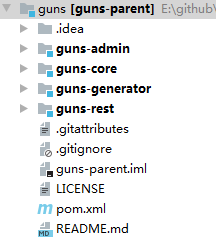

# CinemaMicro

## 技术选型

传统业务应用存在的问题：

+ 单一业务开发，后期维护及迭代困难；
+ 不利于扩展；
+ 部署和回滚困难；

选择微服务开发：

Dubbo + SpringBoot

## 业务划分

将整个系统拆分为六个模块，用户模块，影院模块，影片模块，订单模块，支付模块，以及业务监控。

## 环境构建

https://gitee.com/stylefeng/guns/tree/v4.2/，选择下载V4.2版本的Guns框架，导入idea。

## 业务开发文档整理

[API网关开发](doc/ApiDev.md)

[用户模块开发](doc/UserDev.md)

