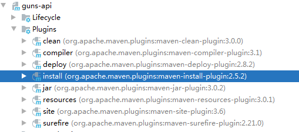

[TOC]


# API网关

类似于设计模式中的Facade模式

## 原理

## 常见作用

+ 身份验证和安全
+ 审查和检测
+ 动态路由
+ 压力测试
+ 负载均衡（Dubbo自带）
+ 静态相应处理

## 构建

在项目中复制一份`guns-rest`模块并重命名为`guns-gateway`，修改其`pom.xml`，并在主模块 `pom.xml`中添加`guns-gateway`。

```xml
<modules>
	<module>guns-admin</module>
	<module>guns-core</module>
	<module>guns-rest</module>
	<module>guns-generator</module>
	<module>guns-gateway</module>
</modules>
```

## 集成Dubbo

在`guns-gateway`模块的`pom.xml`文件中添加`Dubbo`和`ZooKeeper`的依赖：

```xml
<dependency>
    <groupId>com.alibaba.spring.boot</groupId>
    <artifactId>dubbo-spring-boot-starter</artifactId>
    <version>2.0.0</version>
</dependency>
<dependency>
    <groupId>com.101tec</groupId>
    <artifactId>zkclient</artifactId>
    <version>0.11</version>
</dependency>
```

在`application.yml`中添加：

```yaml
spring:
  application:
    name: cinema-gateway
  dubbo:
    server: true
    registry: zookeeper://localhost:2181
```

在启动类上添加注解`@EnableDubboConfiguration`。

## 抽离业务API

### 构建

1. 在项目中复制一份`guns-core`模块并重命名为`guns-api`；

2. 修改其`pom.xml`文件，删除所有依赖，并在主模块的`pom.xml`中添加`guns-api`；

   ```xml
   <modules>
       <module>guns-admin</module>
       <module>guns-core</module>
       <module>guns-rest</module>
       <module>guns-generator</module>
       <module>guns-gateway</module>
       <module>guns-api</module>
   </modules>
   ```

3. 删除其`java`目录下所有包，创建`api`目录，用于存放公用接口类；

4. 执行`maven install`，编译项目构建至本地仓库，使项目其他模块可以引用`guns-api`的jar包；

   

   在主模块中添加依赖：
   
   ```xml
   <dependency>
       <groupId>com.stylefeng</groupId>
       <artifactId>guns-api</artifactId>
       <version>${guns.version}</version>
</dependency>
   ```

   其他模块中引入依赖：
   
   ```xml
   <dependency>
   	<groupId>com.stylefeng</groupId>
   	<artifactId>guns-api</artifactId>
</dependency>
   ```
   
   此时，接口类只需要在`guns-api`中写一份就够了，避免了冗余，即抽离业务 API。