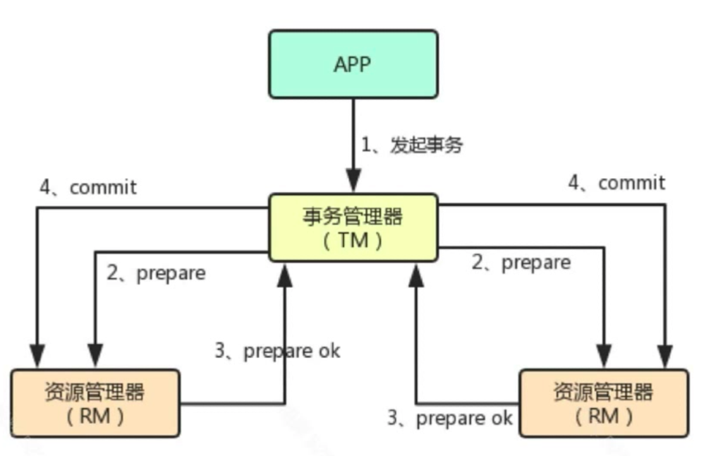
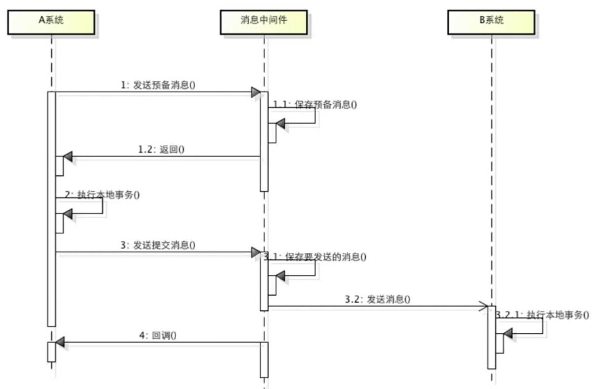
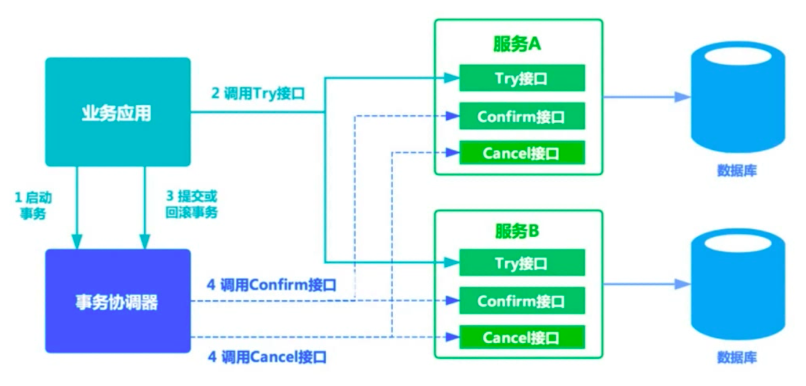
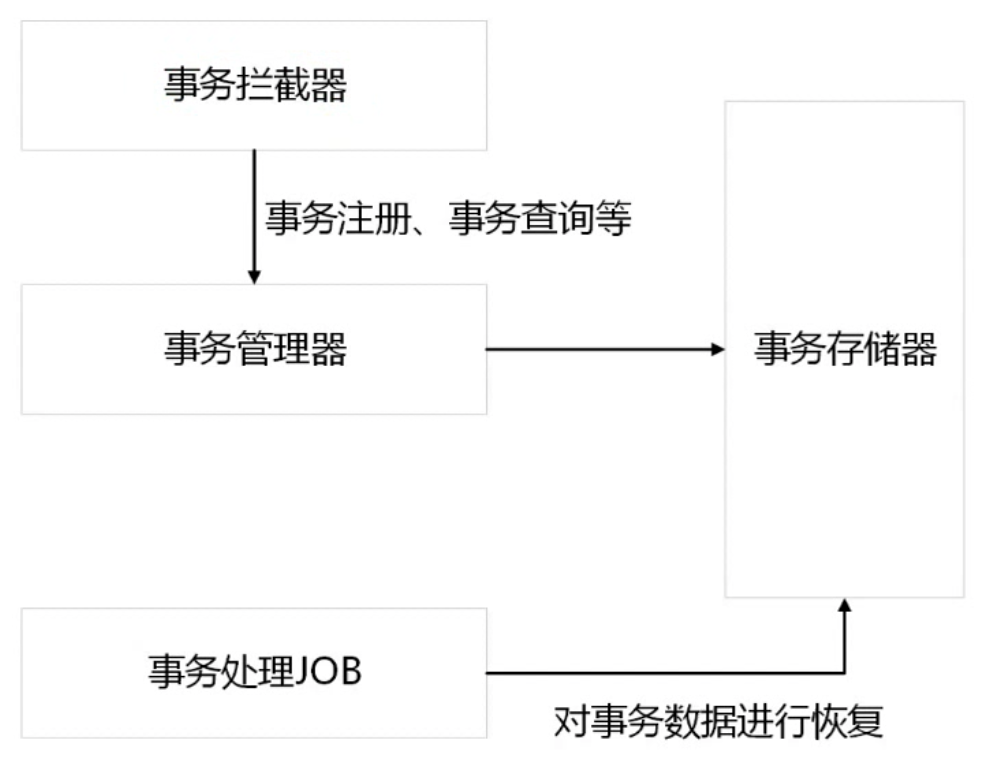

# 分布式事务

## 事务简介

+ 事务是用来保证一组数据操作的完整性和一致性

+ 事务必须满足ACID的四大特性（待补全）

+ 事务具有四种隔离级别（待补全）

+ 事务具有七种传播行为（待补全）

## 什么是分布式事务

分布式事务就是将多个节点的事务看成一个整体处理。

分布式事务由事务参与者、资源服务器、事务管理器等组成，常见例子有，支付、下订单等。

## 实现思路

### 两段式事务


请求阶段：协调者向参与者询问是否可以进行事务提交操作，然后开始等待参与者的响应。

提交阶段：在该阶段，协调者将基于第一个阶段的投票结果进行决策：提交或取消。当且仅当所有的参与者同意提交，事务协调者才通知所有的参与者提交事务，否则协调者将通知所有的参与者回滚事务。

缺点：1）当参与者占有公共资源时，其他第三方节点访问公共资源不得不处于阻塞状态；2）当协调者出错，那么所有的参与者还都处于锁定事务资源的状态中，而无法继续完成事务操作；3）假如在第二阶段中，假如协调者发出commit消息后宕机，接收到这条消息的参与者宕机，此时则无法判断事务状态，无法确定是否已被提交；

### 三段式事务

事务询问 -> 执行事务预提交 -> 进行事务提交或者事务回滚

降低了参与者的阻塞范围，但引入了新问题：在参与者接收到precommit后，网络出现问题，参与者和协调者无法通行，在这种情况下，参与者依然会执行事务的提交。

### 基于XA的分布式事务



缺点：1）性能较差；2）很多nosql不支持XA协议；

### 基于消息的最终一致性方案



缺点：属于强一致性事务，会存在资源浪费

### TCC编程式补偿性事务



TCC事务是柔性事务，在try阶段要对资源做预留，在confirm或cancel阶段释放资源，与基于消息事务对比，TCC的时效性更好。

TCC模型是把锁的粒度完全交给业务处理，它分为三个阶段：

1. Try阶段主要是对业务系统做检测及资源预留；
2. 如果try阶段所有业务资源都预留成功，则执行confirm，否则执行cancel；

+ confirm：不做任务业务检查，仅使用预留的资源执行业务操作，失败会重试；
+ cancel：取消执行业务操作，释放预留的资源，失败会重试；

#### 举例
以简单的电商系统为例，小明在淘宝上花100元买了一本书，获赠10个积分，产生如下操作：

- 订单系统创建商品订单；
- 支付系统接受小明的支付；
- 库存系统扣减产品库存；
- 会员系统给小明账户增加会员积分；

这几个动作需要作为一个事务执行，要同时成功或者同时撤销。如果采用TCC事务模式，那么各个系统需要改造为如下状态：

> 1）订单系统
>
> try：创建一个订单，状态显示为“待支付”；
>
> confirm：更新订单的状态为“已完成”；
>
> cancel：更新订单的状态为“已取消”；
> 2）支付系统
>
> try：假设小明账户中有1000元，冻结小明账户中的100元，此时小明看到的余额依然是1000元；
>
> confirm：将账户余额变为900元，并清除冻结记录；
>
> concel：清除冻结记录；
> 3）库存系统
>
> try：假设库存中还生10本书，冻结其中的一本书，现实库存依然有10本书；
>
> confirm：将剩余库存更新为9本书，并清除冻结记录；
>
> cancel：清除冻结记录；
> 4）会员系统
>
> try：假设小明原因积分为3000，给小明账户预增加10积分，账户显示的积分依然是3000分；
>
> confirm：将账户积分更新为3010，并清除预增加记录；
>
> cancel：清除预增加记录；

缺点：TCC 事务模型对业务方侵入较大，需要业务方把功能的实现上由一个接口拆分为三个，开发成本较高。

同时 TCC 事务为了解决异步网络中的通信失败或超时带来的异常情况，要求业务方在设计实现上要遵循三个策略：

- 允许空回滚：原因是异常发生在阶段 1 时，部分参与方没有收到 try 请求从而触发整个事务的 cancel 操作，try 失败或者没有执行 try 操作的参与方收到 cancel 请求时，要进行空回滚操作；

- 保持幂等性：原因是异常发生在阶段 2 时，比如网络超时，则会重复调用参与方的 confirm/cancel 方法，因此需要这两个方法实现上保证幂等性；

- 防止资源悬挂：原因网络异常导致两个阶段无法保证严格的顺序执行，出现参与方侧 try 请求比 cancel 请求更晚到达的情况，cancel 会执行空回滚而确保事务的正确性，但是此时 try 方法也不可以再被执行；

## 分布式事务框架

+ 全局事务框架GTS

+ 蚂蚁金服分布式事务DTX

+ 开源TCC框架TCC-Transaction（https://github.com/changmingxie/tcc-transaction）

+ 开源TCC框架Byte-（https://github.com/liuyangming/ByteTCC）

## TCC-Transaction分析




仓库：https://github.com/changmingxie/tcc-transaction

### 使用方法

1. 在需要提供分布式事务支持的接口方法上添加 `@Compensable`；
2. 在对应的接口实现方法上也添加 @Compensable，并添加注解参数 `confirmMethod`, `cancelMethod` 和 `transactionContextEditor`；
3. 实现对应的 `confirmMethod` 和 `cancelMethod`（必须和 try 方法在同一个类中）；

注意：

1. 在分布式事务框架中，不要轻易在业务层捕获所有异常，只有在抛出异常的情况下，分布式事务框架才知道该业务是执行失败的，继而执行`cancelMethod`；
2. 使用 TCC-Transaction 时，confirm 和 cancel 的幂等性问题需要人为代码保证；
3. TCC 的数据库应该和业务数据库分开，以保证分布式事务的正常进行；

### 源码分析


tcc的事务并不是数据库的事务，而是应用层的事务，Transaction如下：

```java
public class Transaction implements Serializable {
    private static final long serialVersionUID = 7291423944314337931L;
    // 全局事务id，用来保证事务唯一性
    private TransactionXid xid;
    // 事务的状态
    private TransactionStatus status;
    // 事务类型，ROOT是主事务，BRANCH是分支事务
    private TransactionType transactionType;
	// 事务重试次数
    private volatile int retriedCount = 0;
	// 事务创建时间
    private Date createTime = new Date();
	// 事务最后一次更新的时间
    private Date lastUpdateTime = new Date();
	// 事务的版本号
    private long version = 1;
	// 事务的参与者
    private List<Participant> participants = new ArrayList<Participant>();
	// 附加参数
    private Map<String, Object> attachments = new ConcurrentHashMap<String, Object>();
    ...
}
```

CompensableTransactionAspect是一个AOP切面类，`@Pointcut` 将 `@Compensable` 注解标记为切入点，其签名为`compensableService()`。`@Around` 表示在`compensableService()`之前和之后调用 `interceptCompensableMethod()`。

```java
@Aspect
public abstract class CompensableTransactionAspect {
    private CompensableTransactionInterceptor compensableTransactionInterceptor;
    public void setCompensableTransactionInterceptor(CompensableTransactionInterceptor compensableTransactionInterceptor) {
        this.compensableTransactionInterceptor = compensableTransactionInterceptor;
    }
    @Pointcut("@annotation(org.mengyun.tcctransaction.api.Compensable)")
    public void compensableService() {
    }
    @Around("compensableService()")
    public Object interceptCompensableMethod(ProceedingJoinPoint pjp) throws Throwable {
        return compensableTransactionInterceptor.interceptCompensableMethod(pjp);
    }
    public abstract int getOrder();
}
```

CompensableTransactionInterceptor是事务拦截器，具有以下作用：

1. 将事务区分为ROOT事务和PROVIDER分支事务；
2. 不断地修改数据库内的状态（初始化事务、修改事务状态）；
3. 修改和清除事务管理区中的事务队列；
4. 并没有执行目标对象方法，pjp.proceed() 其实是交给了下一个拦截器 ResourceCoordinatorInterceptor；

```java
public class CompensableMethodContext {
    ProceedingJoinPoint pjp = null;
    Method method = null;
	// 解析得到的Compensable注解
    Compensable compensable = null;

    Propagation propagation = null;
	// 保存了全局事务id和事务状态，在调用事务参与者Participant的confirm或cancel方法时会传递过去。
    TransactionContext transactionContext = null;

    public CompensableMethodContext(ProceedingJoinPoint pjp) {
        this.pjp = pjp;
        this.method = getCompensableMethod();
        this.compensable = method.getAnnotation(Compensable.class);
        this.propagation = compensable.propagation();
        this.transactionContext = FactoryBuilder.factoryOf(compensable.transactionContextEditor()).getInstance().get(pjp.getTarget(), method, pjp.getArgs());
    }
    ...
}
public class CompensableTransactionInterceptor {
	public Object interceptCompensableMethod(ProceedingJoinPoint pjp) throws Throwable {
    	// 通过pjp解析各种属性，组成CompansableMethodContext对象
    	CompensableMethodContext compensableMethodContext = new CompensableMethodContext(pjp);
    	// 是否有存在的事务队列（从ThreadLocal获取transactions来判断当前线程是否已经有事务）
    	boolean isTransactionActive = transactionManager.isTransactionActive();
    	if (!TransactionUtils.isLegalTransactionContext(isTransactionActive, compensableMethodContext)) {
        	throw new SystemException("no active compensable transaction while propagation is mandatory for method " + compensableMethodContext.getMethod().getName());
    	}
		// 获取并判断当前事务的角色（ROOT表示主事务，PROVIDER表示分支事务或事务参与者），并根据其角色调用不同的方法来处理。
    	switch (compensableMethodContext.getMethodRole(isTransactionActive)) {
        	// 处理主事务切面
        	case ROOT:
            	return rootMethodProceed(compensableMethodContext);
        	// 处理PROVIDER事务切面
        	case PROVIDER:
            	return providerMethodProceed(compensableMethodContext);
        	default:
            	return pjp.proceed();
    	}
	}
    
    /**
     * 1. 开启全局事务
     * 2. 持久化全局事务
     * 3. 注册全局事务
     * 4. 判断应该是confirm还是cancel
     * 5. 清除事务
     *
     * @param compensableMethodContext
     * @return
     * @throws Throwable
     */
    private Object rootMethodProceed(CompensableMethodContext compensableMethodContext) throws Throwable {
        Object returnValue = null;
        Transaction transaction = null;
        boolean asyncConfirm = compensableMethodContext.getAnnotation().asyncConfirm();
        boolean asyncCancel = compensableMethodContext.getAnnotation().asyncCancel();
        Set<Class<? extends Exception>> allDelayCancelExceptions = new HashSet<Class<? extends Exception>>();
        allDelayCancelExceptions.addAll(this.delayCancelExceptions);
        	allDelayCancelExceptions.addAll(Arrays.asList(compensableMethodContext.getAnnotation().delayCancelExceptions()));
        try {
            /**
             * 开启一个全新的事务
             * 1. 持久化事务形态 -> 全局事务编号
             * 2. 注册一个事务【ThreadLocal】
             */
            transaction = transactionManager.begin(compensableMethodContext.getUniqueIdentity());
            try {
                // 执行后续方法
                returnValue = compensableMethodContext.proceed();
            } catch (Throwable tryingException) {
                if (!isDelayCancelException(tryingException, allDelayCancelExceptions)) {
                    logger.warn(String.format("compensable transaction trying failed. transaction content:%s", JSON.toJSONString(transaction)), tryingException);
                    // 回滚事务
                    transactionManager.rollback(asyncCancel);
                }
                throw tryingException;
            }
            // 提交事务
            transactionManager.commit(asyncConfirm);
        } finally {
            // 清除队列中的事务
            transactionManager.cleanAfterCompletion(transaction);
        }
        return returnValue;
    }

    private Object providerMethodProceed(CompensableMethodContext compensableMethodContext) throws Throwable {
        Transaction transaction = null;
        boolean asyncConfirm = compensableMethodContext.getAnnotation().asyncConfirm();
        boolean asyncCancel = compensableMethodContext.getAnnotation().asyncCancel();
        try {
            switch (TransactionStatus.valueOf(compensableMethodContext.getTransactionContext().getStatus())) {
                case TRYING:
                    // 初始化一份事务参与者的数据进入到当前服务中，并向事务管理器注册事务
                    transaction = transactionManager.propagationNewBegin(compensableMethodContext.getTransactionContext());
                    return compensableMethodContext.proceed();
                case CONFIRMING:
                    // 修改状态
                    try {
                        transaction = transactionManager.propagationExistBegin(compensableMethodContext.getTransactionContext());
                        // 修改事务状态为CONFIRMING，并持久化更新，提交事务
                        transactionManager.commit(asyncConfirm);
                    } catch (NoExistedTransactionException excepton) {
                        //the transaction has been commit,ignore it.
                    }
                    break;
                case CANCELLING:
                    try {
                        transaction = transactionManager.propagationExistBegin(compensableMethodContext.getTransactionContext());
                        // 修改事务状态为 CANCELLING，并持久化更新，回滚事务
                        transactionManager.rollback(asyncCancel);
                    } catch (NoExistedTransactionException exception) {
                        //the transaction has been rollback,ignore it.
                    }
                    break;
            }
        } finally {
            // 清除事务
            transactionManager.cleanAfterCompletion(transaction);
        }
        Method method = compensableMethodContext.getMethod();
        return ReflectionUtils.getNullValue(method.getReturnType());
    }

    private boolean isDelayCancelException(Throwable throwable, Set<Class<? extends Exception>> delayCancelExceptions) {
        if (delayCancelExceptions != null) {
            for (Class delayCancelException : delayCancelExceptions) {
                Throwable rootCause = ExceptionUtils.getRootCause(throwable);
                if (delayCancelException.isAssignableFrom(throwable.getClass())
                        || (rootCause != null && delayCancelException.isAssignableFrom(rootCause.getClass()))) {
                    return true;
                }
            }
        }
        return false;
    }
}
```

TransactionManager

```java
public class TransactionManager {
    private TransactionRepository transactionRepository;
    private static final ThreadLocal<Deque<Transaction>> CURRENT = new ThreadLocal<Deque<Transaction>>();
    private ExecutorService executorService;
	...

    // 开启事务，持久化到repository，注册到ThreadLocal
    public Transaction begin(Object uniqueIdentify) {
        Transaction transaction = new Transaction(uniqueIdentify,TransactionType.ROOT);
        transactionRepository.create(transaction);
        registerTransaction(transaction);
        return transaction;
    }
    
    // 从主事务的上下文创建分支事务，xid不变，事务类型变化
    public Transaction propagationNewBegin(TransactionContext transactionContext) {
        Transaction transaction = new Transaction(transactionContext);
        transactionRepository.create(transaction);
        registerTransaction(transaction);
        return transaction;
    }

    // 从事务上下文同步事务状态到ThreadLocal
    public Transaction propagationExistBegin(TransactionContext transactionContext) throws NoExistedTransactionException {
        Transaction transaction = transactionRepository.findByXid(transactionContext.getXid());
        if (transaction != null) {
            transaction.changeStatus(TransactionStatus.valueOf(transactionContext.getStatus()));
            registerTransaction(transaction);
            return transaction;
        } else {
            throw new NoExistedTransactionException();
        }
    }
    
	public void commit(boolean asyncCommit) {
        // 从ThreadLocal获取当前事务
        final Transaction transaction = getCurrentTransaction();
        transaction.changeStatus(TransactionStatus.CONFIRMING);
		// 数据库更新transaction
        transactionRepository.update(transaction);
        if (asyncCommit) {
            try {
                Long statTime = System.currentTimeMillis();
                // 通过线程池异步执行事务提交
                executorService.submit(new Runnable() {
                    @Override
                    public void run() {
                        commitTransaction(transaction);
                    }
                });
                logger.debug("async submit cost time:" + (System.currentTimeMillis() - statTime));
            } catch (Throwable commitException) {
                logger.warn("compensable transaction async submit confirm failed, recovery job will try to confirm later.", commitException);
                throw new ConfirmingException(commitException);
            }
        } else {
            // 同步执行事务提交
            commitTransaction(transaction);
        }
    }

    private void commitTransaction(Transaction transaction) {
        try {
            // 调用事务参与者的commit方法
            transaction.commit();
            // 事务结束，在数据库删除当前事务，如果commit异常，不会删除数据库内事务记录，为了重试补偿
            transactionRepository.delete(transaction);
        } catch (Throwable commitException) {
            logger.warn("compensable transaction confirm failed, recovery job will try to confirm later.", commitException);
            throw new ConfirmingException(commitException);
        }
    }

    public void rollback(boolean asyncRollback) {
        final Transaction transaction = getCurrentTransaction();
        transaction.changeStatus(TransactionStatus.CANCELLING);
        transactionRepository.update(transaction);
        if (asyncRollback) {
            try {
                executorService.submit(new Runnable() {
                    @Override
                    public void run() {
                        rollbackTransaction(transaction);
                    }
                });
            } catch (Throwable rollbackException) {
                logger.warn("compensable transaction async rollback failed, recovery job will try to rollback later.", rollbackException);
                throw new CancellingException(rollbackException);
            }
        } else {
            rollbackTransaction(transaction);
        }
    }
        
    // 把transaction注册到ThreadLocal对象中
    private void registerTransaction(Transaction transaction) {
        if (CURRENT.get() == null) {
            CURRENT.set(new LinkedList<Transaction>());
        }
        CURRENT.get().push(transaction);
    }

    // 事务结束，从栈中弹出结束的事务
    public void cleanAfterCompletion(Transaction transaction) {
        if (isTransactionActive() && transaction != null) {
            Transaction currentTransaction = getCurrentTransaction();
            if (currentTransaction == transaction) {
                CURRENT.get().pop();
                if (CURRENT.get().size() == 0) {
                    CURRENT.remove();
                }
            } else {
                throw new SystemException("Illegal transaction when clean after completion");
            }
        }
    }
    ...
}
```

ResourceCoordinatorAspect：主要是为了设置事务的参与者

```java
@Aspect
public abstract class ResourceCoordinatorAspect {
    private ResourceCoordinatorInterceptor resourceCoordinatorInterceptor;
    @Pointcut("@annotation(org.mengyun.tcctransaction.api.Compensable)")
    public void transactionContextCall() {
        
    }
    @Around("transactionContextCall()")
    public Object interceptTransactionContextMethod(ProceedingJoinPoint pjp) throws Throwable {
        return resourceCoordinatorInterceptor.interceptTransactionContextMethod(pjp);
    }
    public void setResourceCoordinatorInterceptor(ResourceCoordinatorInterceptor resourceCoordinatorInterceptor) {
        this.resourceCoordinatorInterceptor = resourceCoordinatorInterceptor;
    }
    public abstract int getOrder();
}
```

ResourceCoordinatorInterceptor：主要处理 try 阶段的事情，在 try 阶段，就将所有的“资源”封装完成并交给事务管理器。然后事务管理器修改数据库状态。

“资源”指“事务资源”，即事务的参与者：confirm上下文，cancel上下文，分支事务信息。

```java
public class ResourceCoordinatorInterceptor {
    private TransactionManager transactionManager;
    public void setTransactionManager(TransactionManager transactionManager) {
        this.transactionManager = transactionManager;
    }

    public Object interceptTransactionContextMethod(ProceedingJoinPoint pjp) throws Throwable {
		// 获取当前事务
        Transaction transaction = transactionManager.getCurrentTransaction();
        if (transaction != null) {
            switch (transaction.getStatus()) {
				// 只需要在trying时，获取到参与者信息，并设置到transaction中
                case TRYING:
                    enlistParticipant(pjp);
                    break;
                case CONFIRMING:
                    break;
                case CANCELLING:
                    break;
            }
        }
        // 执行目标方法
        return pjp.proceed(pjp.getArgs());
    }

    private void enlistParticipant(ProceedingJoinPoint pjp) throws IllegalAccessException, InstantiationException {
		// 获取@Compensable注解信息
        Method method = CompensableMethodUtils.getCompensableMethod(pjp);
        if (method == null) {
            throw new RuntimeException(String.format("join point not found method, point is : %s", pjp.getSignature().getName()));
        }
        Compensable compensable = method.getAnnotation(Compensable.class);
        String confirmMethodName = compensable.confirmMethod();
        String cancelMethodName = compensable.cancelMethod();
        Transaction transaction = transactionManager.getCurrentTransaction();
        TransactionXid xid = new TransactionXid(transaction.getXid().getGlobalTransactionId());
        if (FactoryBuilder.factoryOf(compensable.transactionContextEditor()).getInstance().get(pjp.getTarget(), method, pjp.getArgs()) == null) {
            FactoryBuilder.factoryOf(compensable.transactionContextEditor()).getInstance().set(new TransactionContext(xid, TransactionStatus.TRYING.getId()), pjp.getTarget(), ((MethodSignature) pjp.getSignature()).getMethod(), pjp.getArgs());
        }
        Class targetClass = ReflectionUtils.getDeclaringType(pjp.getTarget().getClass(), method.getName(), method.getParameterTypes());
        InvocationContext confirmInvocation = new InvocationContext(targetClass,
                confirmMethodName,
                method.getParameterTypes(), pjp.getArgs());
        InvocationContext cancelInvocation = new InvocationContext(targetClass,
                cancelMethodName,
                method.getParameterTypes(), pjp.getArgs());
        Participant participant =
                new Participant(
                        xid,
                        confirmInvocation,
                        cancelInvocation,
                        compensable.transactionContextEditor());
        transactionManager.enlistParticipant(participant);
    }
}
```

此时经过两个拦截器后，才调用到目标对象方法，即对应try逻辑的被切方法。