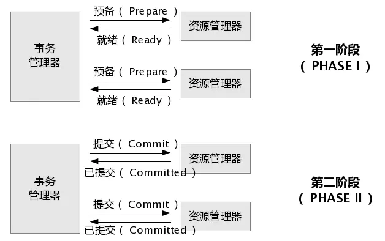
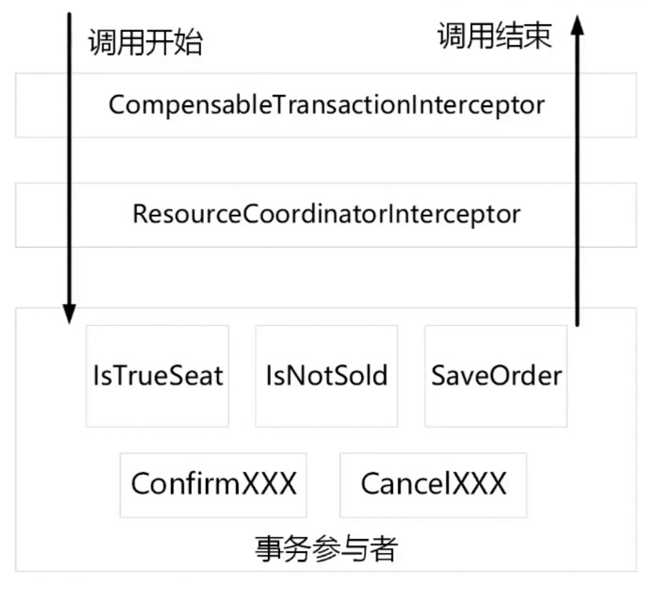

# 分布式事务

## 事务简介

+ 事务是用来保证一组数据操作的完整性和一致性

+ 事务必须满足ACID的四大特性（待补全）

+ 事务具有四种隔离级别（待补全）

+ 事务具有七种传播行为（待补全）

## 什么是分布式事务

分布式事务就是将多个节点的事务看成一个整体处理。

分布式事务由事务参与者、资源服务器、事务管理器等组成，常见例子有，支付、下订单等。

## 实现思路

### 两段式事务

请求阶段：协调者向参与者询问是否可以进行事务提交操作，然后开始等待参与者的响应。

提交阶段：在该阶段，协调者将基于第一个阶段的投票结果进行决策：提交或取消。当且仅当所有的参与者同意提交，事务协调者才通知所有的参与者提交事务，否则协调者将通知所有的参与者回滚事务。

缺点：1）当参与者占有公共资源时，其他第三方节点访问公共资源不得不处于阻塞状态；2）当协调者出错，那么所有的参与者还都处于锁定事务资源的状态中，而无法继续完成事务操作；3）假如在第二阶段中，假如协调者发出commit消息后宕机，接收到这条消息的参与者宕机，此时则无法判断事务状态，无法确定是否已被提交；

### 三段式事务

事务询问 -> 执行事务预提交 -> 进行事务提交或者事务回滚

降低了参与者的阻塞范围，但引入了新问题：在参与者接收到precommit后，网络出现问题，参与者和协调者无法通行，在这种情况下，参与者依然会执行事务的提交。

### 基于XA的分布式事务

缺点：1）性能较差；2）很多nosql不支持XA协议；

### 基于消息的最终一致性方案

缺点：属于强一致性事务，会存在资源浪费

### TCC编程式补偿性事务

TCC事务是柔性事务，在try阶段要对资源做预留，在confirm或cancel阶段释放资源，与基于消息事务对比，TCC的时效性更好。

## 分布式事务框架

+ 全局事务框架GTS

+ 蚂蚁金服分布式事务DTX

+ 开源TCC框架TCC-Transaction（https://github.com/changmingxie/tcc-transaction）

+ 开源TCC框架Byte-（https://github.com/liuyangming/ByteTCC）

## TCC-Transaction分析

仓库：https://github.com/changmingxie/tcc-transaction

1. 在需要提供分布式事务支持的接口方法上添加 `@Compensable`；
2. 在对应的接口实现方法上也添加 @Compensable，并添加注解参数 `confirmMethod`, `cancelMethod` 和 `transactionContextEditor`；
3. 实现对应的 `confirmMethod` 和 `cancelMethod`（必须和 try 方法在同一个类中）；

注意：

1. 在分布式事务框架中，不要轻易在业务层捕获所有异常，只有在抛出异常的情况下，分布式事务框架才知道该业务是执行失败的，继而执行`cancelMethod`；
2. 使用 TCC-Transaction 时，confirm 和 cancel 的幂等性问题需要人为代码保证；
3. TCC 的数据库应该和业务数据库分开，以保证分布式事务的正常进行；

